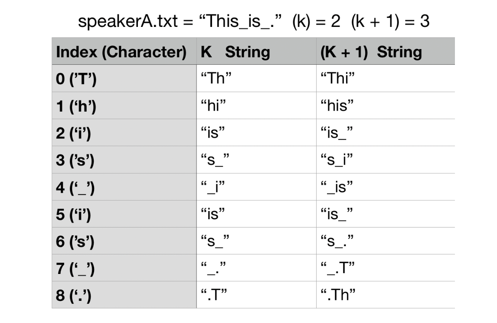
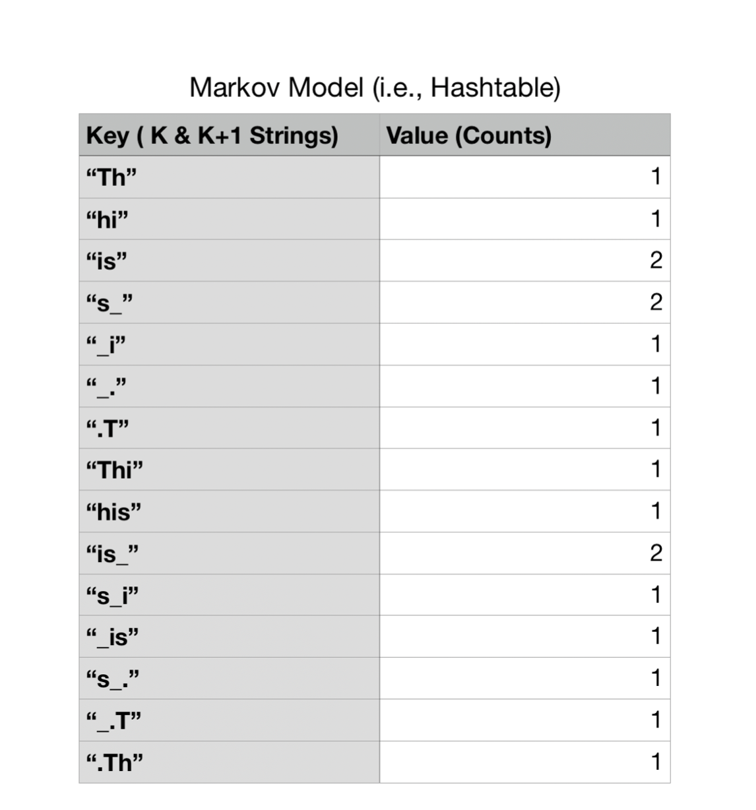
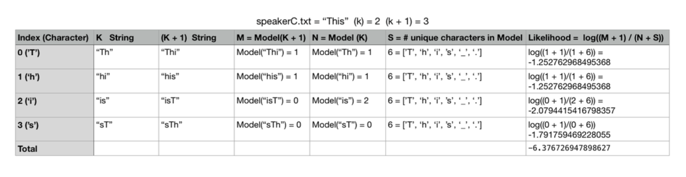
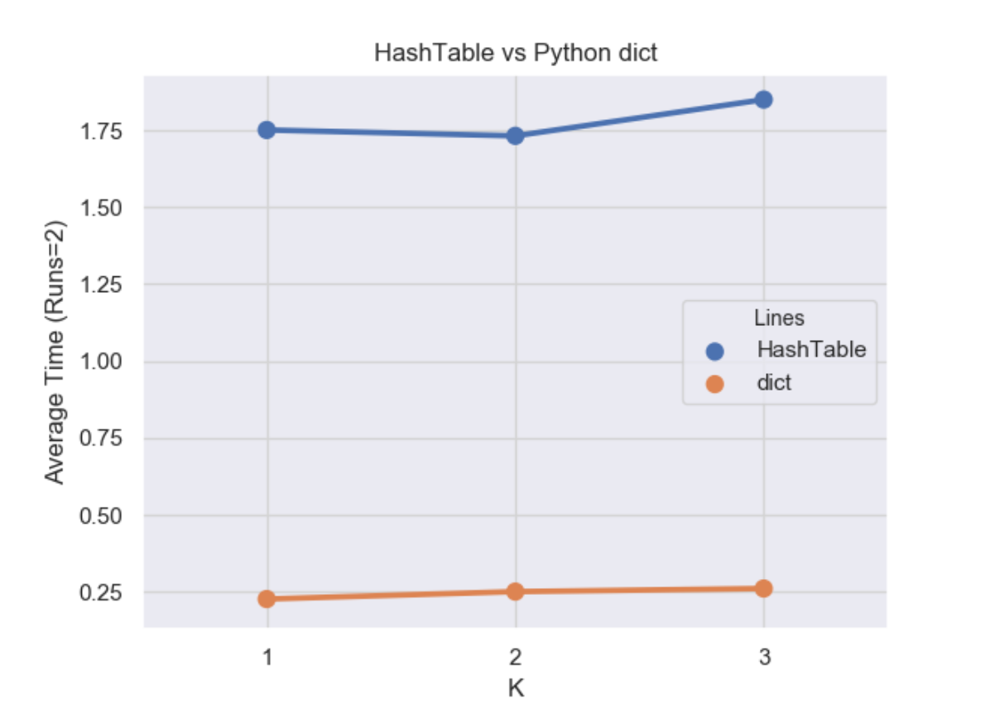

# MPCS 51042 Python Programming Final Project

## Introduction

In this final project, you will develop a modeling system using Markov Models.
You don’t have to understand them completely (or at all) for this assignment but here are some helpful slides if you are curious:

http://cecas.clemson.edu/~ahoover/ece854/refs/Ramos-Intro-HMM.pdf

Markov models can be used to capture the statistical relationships present in a language like English. These models allow us to go beyond simplistic observations, like the frequency with which specific letters or words appear in a language, and instead to capture the relationships between words or letters in sequences. As a result, we can not only appreciate that the letter “q” appears in text at a certain rate, but also that it is virtually always followed by a “u.” Similarly, “to be” is a much more likely word sequence than “to is.”

One application of Markov models is in analyzing actual text and assessing the likelihood that a particular person uttered it. That is one objective of this assignment.

The other objective for this assignment is to create a hash tables module. Hash tables are data structures that store associations between keys and values (exactly like dictionaries in Python) and provide an efficient means of looking up the value associated with a given key. Hash tables find a desired entry rapidly by limiting the set of places where it can be. They avoid “hot spots,” even with data that might otherwise all seem to belong in the same place, by dispersing the data through hashing.

Apart from developing an appreciation of how hashing and hash tables work, you will also be better prepared if ever you need to write your own hash table in the future. For instance, you may use a language (like C) that does not feature a built-in hash table. Or, the hash table that is used by a language, like Python, may interact poorly with your particular data, obligating you to design a custom-tailored one. After completing this assignment, you should consider hash tables to be in your programming repertoire.

## Part 1: Hash Tables & Linear Probing

In the interest of building and testing code one component at a time, you will start by building a hash table. Once you have gotten this module up and running, you will use it in your construction of a Markov model for speaker attribution.

There are different types of hash tables; for this assignment, we will use the type that is implemented with **linear probing**.

Please look at `proj/hashtable.py`. You will modify this file and must implement a hash table using the linear probing algorithm. The class `Hashtable`:

* Implement the required dunder methods in `Hashtable`.
* May assume all keys are strings.
* Define an `__init__(self, capacity, default_value, load_factor, growth_factor)` constructor:
  * `capacity` - initial number of cells to use.  It must create a list of empty cells of the specified length. (You may assume this is always greater than zero.)
  * `default_value` - value to return when looking up a key that has not been inserted.
  * `load_factor` - A floating point number (0, 1].  If the fraction of occupied cells grows beyond the `load_factor` after an update, then you must perform a rehashing of the table. (See below.)
  * `growth_factor` - An integer (>1) that represents how much to grow the table by when rehashing.  For example, if `growth_factor = 2` then the size of the hash table would double on each rehashing.
* It must use a **single** Python `list` (the already-defined `self._items`) to hold the key and value as a tuple in the table.  The tuples can contain any additional components as needed.
* We have provided a `self._hash` function that should be used, do not use the built in `hash()/__hash__`.
* You are free to implement additional properties, attributes, and methods as needed to implement this class.

### Rehashing

A hash table built on linear probing does not have unlimited capacity, since each cell can only contain a single value and there are a fixed number of cells.
But, we do not want to have to anticipate how many cells might be used for a given hash table in advance and hard-code that number in for the capacity of the hash table. 
Therefore, we will take the following approach: the cell capacity passed into the `__init__` will represent the initial size of the table. 
If the fraction of occupied cells grows beyond `load_factor` after an update, then we will perform an operation called rehashing:
We will expand the size of our hash table, and migrate all the data into their proper locations in the newly-expanded hash table (i.e., each key-value pair is hashed again, with the hash function now considering the new size of the table).
We will grow the size of the table by `growth_factor`; for instance, if `growth_factor = 2`, the size of the hash table will double each time it becomes too full.

### Deletion

Deleting an item in a hash table that uses linear probing is tricky. Simply removing the key-value pair could potentially invalidate the entire table. For our implementation, we will “logically” delete the key-value pairings.
This means that you should have marker for each key-value pair that indicates whether or not it’s been “deleted” (e.g., having a third component of the tuple to represent the marker).
If the marker is `True` then the key-value pair is still inside the table; otherwise a `False` marker says that the pair was deleted at some point.

You should think about how this helps with implementing your insertion and lookup methods... You will “physically” remove the key-value pairings that have been “logically” removed during rehashing.

### Tips

* While not required, you may find it useful to use the `namedtuple` factory function to create your Hashtable's entries: https://docs.python.org/3/library/collections.html#collections.namedtuple

## Part 2: A Speaker Recognition System


Markov models are used significantly in speech recognition systems, and used heavily in the domains of natural language processing, machine learning, and AI.

A Markov model defines a probabilistic mechanism for randomly generating sequences over some alphabet of symbols. A `k`-th order Markov model tracks the last `k` letters as the context for the present letter. We will build a module called `markov` that will work for any positive value of `k` provided.  This module will reside in `proj/markov.py`

While we use the term "letter", we will actually work with all characters (letters, digits, spaces, punctuation). Our code will distinguish between upper & lower case letters.

### Building the Markov Model (Learning Algorithm)

Given a string of text from an unidentified speaker, we will use a Markov model for a known speaker to assess the likelihood that the text was uttered by that speaker. Thus, the first step is building a Markov Model on known text from a speaker. For this assignment, the Markov Model will be represented as a `Hashtable` (Note: You will not use all the methods you defined in its implementation).

**You must use your implementation and not the built-in dictionaries from Python!**

You will be given an integer value of `k` at the start of the program. Each key-value pairing inside the table contains string keys with length `k` and `k + 1` and values set to the number of times those keys appeared in the text as substrings.

For example, let’s say you have a file called speakerA.txt that contains the following text:

```
This_is_.
```

**Note: You consider all characters in the text.**  Punctuation, special characters, whitespace characters, etc., are all considered valid.  Even if the text does not make any sense, you will still generate a Markov Model.

We will use this text `"This_is_."` to create a Markov model for Speaker A.  The algorithm is as follows:

Starting from the beginning of text from some known speaker:

1. For each character in the known text, you generate a string of length `k` that includes the current character plus k−1 succeeding characters (*Note:* The model actually works by finding the k preceding letters but our way works too because we are using a wrap-around effect.).
2. For each character in the known text, you generate a string of length `k+1` that includes the current character plus `k` succeeding characters.  (e.g. for the first character 'T', you'd generate 'Th' and 'Thi' if k=2)
3. For certain characters, they will not have `k` or `k+1` succeeding characters.   For example, what are the succeeding characters for the character `'.'`? if `k = 2` for our example text?  We will **wrap around**: we will think of the string circularly, and glue the beginning of the string on to the end to provide a source of the needed context.  (e.g. for the example string the strings generated for the last character '.' would be '.T' and '.Th'.)

Below is a diagram of all the k and k+1 length strings that are generated from the speakerA.txt file given k=2:



The Markov Model (i.e., your `Hashtable`) will contain the number of times those `k` and `k + 1` were generated via the known text. Thus, for the speakerA.txt file, the Markov Model generated will be the following:



Most of the `k` and `k+1` strings were only generated once, but some such as `"is"` occur more than once.

### Determining the likelihood of unidentified text (Testing algorithm)

As we stated earlier, given a string of text from an unidentified speaker, we will use the Markov model for a known speaker to assess the likelihood that the text was uttered by that speaker. Likelihood, in this context, is the probability of the model generating the unknown sequence.

**If we have built models for different speakers, then we will have likelihood values for each, and will choose the speaker with the highest likelihood as the probable source.**

These probabilities can be very small, since they take into account every possible phrase of a certain length that a speaker could have uttered. Therefore, we expect that all likelihoods are low in an absolute sense, but will still find their relative comparisons to be meaningful. Very small numbers are problematic, however, because they tax the precision available for floating-point values. The solution we will adopt for this problem is to use log probabilities instead of the probabilities themselves. This way, even a very small number is represented by a negative value in the range between zero and, for instance, -20. If our **log probabilities** are negative and we want to determine which probability is more likely, will the greater number (the one closer to zero) represent the higher or lower likelihood, based on how logarithms work?

Note that we will use the `math.log` function, which calculates natural logarithms. Your code should use this base for its logarithms. While any base would suffice to ameliorate our real number precision problem, we will be comparing your results to the results from our implementation, which itself uses natural logs.

The process of determining likelihood given a model is similar to the initial steps of building the Markov Model in the previous section. Starting from the beginning of text for some unknown speaker:

1. For each character in the unknown text, you generate a string of length k that includes the current character plus k − 1 succeeding characters.

2. For each character in the known text, you generate a string of length k + 1 that includes the current character plus k succeeding characters.

3. For certain characters, they will not have k or k + 1 succeeding characters. You will use the same wrap around mechanism as described previously.  (**Note:** These steps are identical to the steps in the learning process, think about what that suggests for your design!)

4. We then need to compute the probability that the string of length `k+1` follows a string of length `k`. To do this, look up in our data table the number of times that we have observed the string of length `k+1` (we will call this `M`), and the number of times we have observed the string of length `k` (we will call this `N`).  The log probability would be `log(M/N)`.

5. We need to keep in mind that we are constructing the model with one set of text and using it to evaluate other text. The specific letter sequences that appear in that new text are not necessarily guaranteed ever to have appeared in the original text. Consequently, we are at risk of dividing by zero.

It turns out that there is a theoretically-justifiable solution to this issue, called Laplace smoothing. We modify the simple equation above by adding to the denominator the number of unique characters that appeared in the original text we used for modeling. For instance, if every letter in the alphabet appeared in the text, we add 26. (In practice, the number is likely to be greater, because we distinguish between upper- and lower-case letters, and consider spaces, digits, and punctuation as well.) Because we have added this constant to the denominator, it will never be zero. Next, we must compensate for the fact that we have modified the denominator; a theoretically sound way to balance this is to add one to the numerator. Symbolically, if N is the number of times we have observed the k succeeding letters and M is the number of times we have observed those letters followed by the present letter, and S is the size of the ”alphabet” of possible characters, then our probability is

```
log((M + 1)/(N + S))
```

For example, lets say you have file called speakerC.txt (i.e., the unidentified text):

```
This
```

Calculating the total likelihood requires summing all of the individual likelihoods.  It will be done in the following way using the model we built from speakerA.txt:



**Note:**

- When we say "Model(K)" we are looking at the hash table inside the model and retrieving the counts for that string.
- S is the number of unique characters that we encountered while building the model.  This means while building the model you need to create a set of all unique characters.

### Markov Class

Inside `proj/markov.py`, you will implement a `Markov` class with the following methods

1. An `__init__(self, k, text, use_hashtable)` method.
  * `k` will be the order `k` for your Markov model.
  * `text` will be the text used to build the model.
  * If `use_hashtable` is true, you will use your `Hashtable` class internally.  We have provided the constant `HASH_CELLS` as a good starting point for your hashtables, though they will need to grow significantly to accommodate the sample text.  You can instantiate your hash table as `Hashtable(HASH_CELLS, 0, 0.5, 2)`
  * If `use_hashtable` is false, you will use the built in `dict` data structure to represent the internal Markov model.
  This will allow us to run performance tests on whether your implementation of the hash table is faster or slower than using the built in `dict` type for this problem.
2. `log_probability(self, s)` takes a string and returns the log probability that the modeled speaker uttered it, using the approach described above.

### `identify_speaker`

You will also need to implement the function `identify_speaker(speech1, speech2, speech3, k, use_hashtable)`.

This function will be called by the `main` function with three strings (`speech1`, `speech2`, `speech3`) and a value of `k` and `use_hashtable` to instantiate your Markov model.

The function should learn models for `speech1` and `speech2`, calculate the **normalized log probabilities** that those two speakers uttered `speech3` and determine which speaker is more likely.

The return value of the function should be a 3-element tuple with the two calculated probabilities and a string "A" or "B" indicating which speaker most likely gave `speech3`.

While the log_probability function yields the likelihood that a particular speaker uttered a specified string of text, this probability may be misleading because it depends upon the length of the string. Because there are many more possible strings of a greater length, and these probabilities are calculated across the universe of all possible strings of the same length, we should expect to see significant variance in these values for different phrases. To reduce this effect, we will divide all of our probabilities by the length of the string, to yield normalized ones. To be clear, this division does not occur in log_probability, but rather in identify_speaker. Also, note that we will be calculating log probabilities, under different models, for the same string. Thus, string length differences are not a factor during a single run of our program. Rather, we choose to normalize in this fashion because we want outputs for different runs to be more directly comparable when they may pertain to different length quotes being analyzed.

**Note:** You can test our implementation of this file by running the tests inside `proj/test_markov.py`.  You must pass these tests in less than 60 seconds to avoid a penalty.

**Note:** There are additional test cases in `proj/test_markov_long.py`, these are mostly redundant with the tests in `test_markov` and can take a long time to run.


## Part 3: Driver Files & Performance Testing

You will need to implement a driver for the speaker recognition system inside `proj/driver.py`.
We have provided a set of files containing text from United States presidential debates from the 2004 and
2008 general elections. In the 2004 election, George W. Bush debated John Kerry; in the 2008 debates,
Barack Obama went up against John McCain. We have provided single files for Bush, Kerry, Obama, and
McCain to use to build models. These files contain all the text uttered by the corresponding candidates from two debates. We have also provided directories from the third debates of each election year, containing many files, appropriately labeled, that have remarks made by one of the candidates.

Inside `proj/driver.py` the `if __name__ == "__main__"` block will take several command line arguments:

* The first argument is the name of a text file with speeches from speaker A.
* The second argument is the name of a text file with speeches from speaker B.
* The third argument is the name of a text file with text to classify.
* The fourth argument is the order `k` to use for the Markov models.
* The fifth argument is either the string "hashtable" or "dict", indicating which implementation to use.

Your application should read in text from the text files and call your `identify_speaker` function to retrieve log probabilities and the most likely speaker. It should then print output like the following:

```
$ python proj/driver.py speeches/bush1+2.txt speeches/kerry1+2.txt speeches/bush-kerry3/BUSH-0.txt 2 hashable
Speaker A: -2.1670591295191572
Speaker B: -2.2363636778055525

Conclusion: Speaker A is most likely
```

### Performance Testing

Finally, you will write another driver file `proj/performance.py` that will run performance tests on your `Markov` class with your `Hashtable` and `dict` modes.

This file will also take five command line arguments:

* The first argument is the name of a text file with speeches from speaker A.
* The second argument is the name of a text file with speeches from speaker B.
* The third argument is the name of a text file with text to classify.
* The fourth argument is the maximum `k` to use for the Markov models.
* The fifth argument is the number of runs to measure performance.

You will perform time measurements between your Markov model states to determine which one is faster and record these timings inside a single pandas dataframe. Specifically, you will time how fast the identify_speaker returns based on specifying a range of k values starting at 1 to “k” values (inclusive) and running it multiple times (i.e., the “run” command line argument (inclusive)). For example, assume we run the program as follows,

```
$ python proj/performance.py speeches/bush1+2.txt speeches/kerry1+2.txt speeches/bush-kerry3/BUSH-0.txt 2 3
```

This would indicate that you want three runs, for `k=1` and `k=2`, your pandas dataframe might look something like:

| Implementation | K | Run | Time |
|----------------|---|-----|------|
| hashtable      | 1 | 1   | 0.345|
| hashtable      | 1 | 2   | 0.302|
| hashtable      | 1 | 3   | 0.386|
| hashtable      | 2 | 1   | 0.585|
| hashtable      | 2 | 2   | 0.598|
| hashtable      | 2 | 3   | 0.611|
| dict           | 1 | 1   | 0.045|
| dict           | 1 | 2   | 0.130|
| dict           | 1 | 3   | 0.075|
| dict           | 2 | 1   | 0.145|
| dict           | 2 | 2   | 0.166|
| dict           | 2 | 3   | 0.202|

We run multiple times because a single run can be affected by unrelated issues elsewhere on the system.

You will use these timings to make a `seaborn` graph to show how times fluctuated based on the implementation and increasing `k` value.  For each timing above you will then take the average of those timings for each `k`.

**Note:** The structure above might not be the way you choose to structure your dataframe.  **You can only use one pandas dataframe.**

Given that you will be graphing the data inside the dataframe, I would highly recommend you think about how to structure the code based on how `seaborn` will need the data.

**Pandas Tip:** Keep `df.groupby`and `df.loc` in mind.

You can accurately time your code using a snippet like the below:

```
import time

start = time.perf_counter()
tup = identify_speaker(speech1, speech2, speech3, k, use_hashtable=True)
elapsed = start - time.perf_counter()
```

### Graphing

After producing your `pandas` dataframe, you will produce a `seaborn` graph where the x axis will be the `k` values and the y axis will be the **average time of the runs** for each k value per implementation type.  Here's an example graph:



Your graph should be similar, with axes labeled and appropriately scaled so we can see the values.  (That is, if your values are in the range [0, 1] do not make the scale of your graph [0, 14].

You can use a point plot with the following arguments:

```
sns.pointplot(..., linestyle='-', marker='o')
```

Your code should save this graph as `execution_graph.png`.

## Debugging Suggestions

- Make sure you have chosen the right data structure for the Markov model based on the use_hashtable parameter!
- Check your code for handling the wrap-around carefully. It is a common source of errors.
- Test the code for constructing a Markov model using a very small string, such as "abcabd". Check your data structure to make sure that you have the right set of keys and the correct counts.
- Make sure you are using the correct value for S the number of unique characters that appeared in the training text.

## Acknowledgment
This assignment’s text and documentation originated from CAPP 30122 Team @ The University of Chicago. The original development of the assignment was done by Rob Schapire with contributions from Kevin Wayne.
