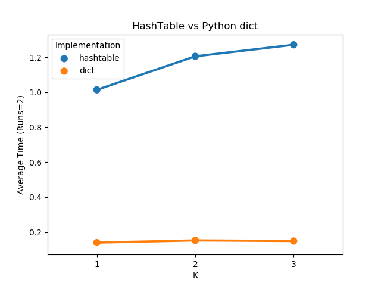

# Markov Model using self created hash table

In this project, Markov Model has been used to identify the speaker from a random speech by creating a hash table from scratch  

The graph below shows the difference between the time taken by dictionary and the hash table created manually  

